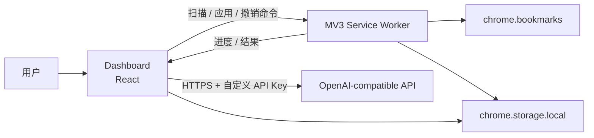
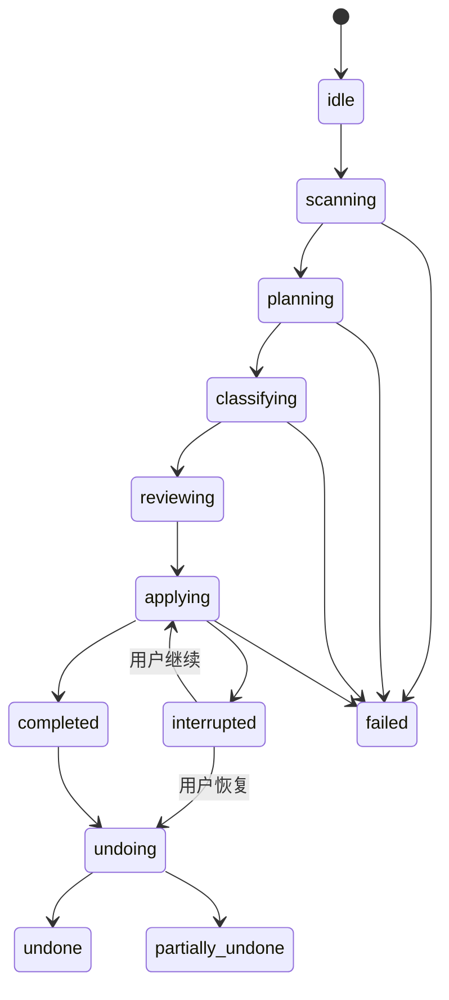

# TidyMarks：MVP 技术架构方案

> 状态：已确定  
> 日期：2026-08-27  
> 范围：Chrome Manifest V3 MVP

## 1. 架构结论

| 决策项 | 最终选择 |
| --- | --- |
| 扩展框架 | WXT |
| 前端 | React + TypeScript（strict） |
| 运行平台 | Chrome Manifest V3 |
| 最低版本 | Chrome 134 |
| 主界面 | 独立全页 Dashboard，不使用 Popup 承载主流程 |
| 后台 | Extension Service Worker |
| 模型协议 | OpenAI-compatible Chat Completions API |
| 数据校验 | Zod；模型响应、消息和持久化数据共用 Schema |
| 本地存储 | `chrome.storage.local`；MVP 不引入 IndexedDB |
| 状态管理 | React `useReducer` + 持久化任务状态；不引入 Redux/Zustand |
| 后端服务 | 无；模型请求由扩展直接发送到用户配置的 API |
| 测试 | Vitest + mocked Chrome API + Playwright 扩展 E2E |

MVP 不使用内容脚本，不读取网页正文，也不建设账号、代理、数据库或计费后端。最低版本设为 Chrome 134，以直接使用 `folderType` 和 `unmodifiable` 等当前书签节点信息，同时减少旧版 MV3 生命周期差异。

## 2. 总体结构



职责边界：

- Dashboard 负责模型配置、书签选择、AI 分批请求、方案预览和进度展示。
- Service Worker 是所有书签写操作的唯一入口，负责应用、撤销、任务锁和检查点。
- Domain 层只处理纯数据，不直接依赖 React、WXT 或 Chrome API。
- `chrome.storage.local` 是跨页面和 Service Worker 生命周期的事实来源，不能依赖全局变量保存任务状态。

## 3. 页面与后台职责

### 3.1 Dashboard

点击扩展图标后打开或复用一个 `dashboard.html` 标签页。主流程不放在 Popup 中，避免窗口关闭导致 UI 状态和模型请求被销毁。

Dashboard 包含五个页面状态；模型设置不占用整理步骤，可从顶部设置入口独立打开并返回原页面：

1. 模型设置：Base URL、API Key、Model、测试连接。
2. 扫描：读取书签树并展示数量统计。
3. 选择：文件夹与书签选择、整理模式和文件夹命名风格。
4. 方案审核：展示最终生成的完整目录树，并在目录节点下展示将要移入的书签；支持逐条修改和排除。
5. 执行结果：成功、失败、重试和撤销最近一次整理。

模型请求由 Dashboard 发起。同一阶段内的批次并行请求，结果按原批次顺序持久化；重新打开后从最后一个连续完成的批次继续。

### 3.2 Service Worker

Service Worker 只承担需要统一控制的能力：

- 打开或复用 Dashboard。
- 调用 `chrome.bookmarks.getTree()` 获取书签树。
- 校验应用前书签的最新位置和可修改性。
- 顺序创建目录并移动书签。
- 保存应用检查点和最近一次撤销快照。
- 执行撤销和失败项重试。
- 向 Dashboard 发送进度事件。

Service Worker 不长期保存内存状态，也不承担长时间的整批模型请求。

## 4. 分层设计

```text
entrypoints/             WXT 运行入口
  background.ts          Service Worker 注册与消息路由
  dashboard/             React 全页应用

src/
  domain/                纯业务规则
    bookmarks/           书签树、节点、路径和可修改性规则
    organize/            分类方案、状态机和校验规则
    undo/                快照与恢复顺序

  application/           用例编排
    scanBookmarks.ts
    generatePlan.ts
    applyPlan.ts
    undoLastApply.ts
    resumeJob.ts

  infrastructure/        外部能力适配
    chrome/
      bookmarksRepository.ts
      storageRepository.ts
      permissionsRepository.ts
    model/
      openAICompatibleClient.ts

  shared/
    messages.ts           Dashboard 与 Service Worker 的类型化协议
    schemas.ts            Zod Schema
    errors.ts             可展示的错误分类
```

依赖方向固定为：`entrypoints → application → domain`，`infrastructure` 实现 application 使用的接口。Domain 不反向依赖浏览器 API。

## 5. 任务状态机



状态必须持久化。每个任务包含 `jobId`、`status`、`updatedAt`、当前批次或写入游标、失败项和错误类型。

同一时间只允许一个会修改书签的任务。`applying`、`undoing` 期间拒绝新的应用请求。

## 6. 模型处理管线

### 6.1 请求位置

模型请求从 Dashboard 发出，不经过项目服务器。原因是模型响应可能较慢，而 MV3 Service Worker 会被回收，不适合承载不可拆分的长请求。

### 6.2 分批策略

为兼容不同上下文长度和限流策略的自定义模型，按整理模式使用可恢复的分批流程：

1. 分类体系准备
   - 保守整理：本地按 Chrome 系统根目录收集现有文件夹路径，作为不可扩展的白名单。
   - 重新规划目录：分批生成候选目录，最后合并为最多两级的统一体系。
   - 本地提取当前目录、域名频次和书签标题。
2. 书签分配
   - 使用固定目录体系分批分类书签。
   - 保守整理的模型结果必须命中对应书签所在系统根目录的已有路径；应用时禁止补建目录。
   - 并行请求完成后，按原批次顺序保存结果和下一批游标。

同一阶段内的分批请求并行发出，结果按原批次顺序合并和持久化；目录合并及书签分配仍按依赖顺序执行。遇到 `429` 或 `5xx` 时读取 `Retry-After`，否则指数退避，最多自动重试两次。

### 6.3 输出约束

模型只能返回：

- `bookmarkId`
- `targetPath`，最多两级
- `reason`

模型不能决定 Chrome `parentId`。`targetRootId` 由本地根据书签所在的 Chrome 系统根目录生成，避免模型伪造节点 ID 或跨根目录移动书签。

所有响应经过 Zod 校验，并验证：

- `bookmarkId` 属于本次选择范围。
- 每条书签最多有一个目标。
- 路径非空、层级不超过两级、名称经过清理。
- 目标不能是不可修改节点或书签节点。

## 7. 扫描与目标目录规则

- 使用 `chrome.bookmarks.getTree()` 获取一次一致的扫描结果。
- 用节点 ID 作为内部主键，不以标题或 URL 作为身份标识。
- 不硬编码书签栏、其他书签等根目录 ID；根据树结构及 `folderType` 动态识别。
- 不扫描或移动 `unmodifiable` 节点。
- 默认保持书签所在的 Chrome 系统根目录，AI 路径只描述该根目录下的相对分类。
- 复用同一父目录下名称完全相同的现有文件夹；不存在时逐级创建。
- MVP 不删除原有空文件夹，空目录清理由后续功能处理。

## 8. 一键应用

应用前，Service Worker 重新读取相关书签，不能直接信任扫描阶段的旧位置。

执行顺序：

1. 创建 `UndoSnapshot`，记录每条待移动书签的 `id`、`parentId` 和 `index`。
2. 将任务设为 `applying`，建立独占任务锁。
3. 按路径逐级解析或创建目标目录，记录所有新建目录 ID。
4. 顺序调用 `chrome.bookmarks.move()`，不并行修改书签树。
5. 每条成功后更新 `appliedIds` 和写入游标。
6. 单条失败加入失败列表，继续后续书签。
7. 完成后设置为 `completed`，展示成功、失败和重试入口。

幂等要求：

- 创建目录前先按 `parentId + title` 查找现有目录。
- 移动前检查当前 `parentId`；已在目标目录时直接标记完成。
- 同一个 `jobId` 的重复应用从持久化游标继续，不能重新从第一条盲目执行。

## 9. 一键撤销

只保存最近一次整理快照，不恢复整棵书签树。

撤销流程：

1. 仅处理 `appliedIds` 中成功移动的书签。
2. 若书签当前仍在本次应用的目标目录，则按原 `parentId` 分组，并按原 `index` 升序移回。
3. 若书签已被用户再次移动、已经删除或原父目录不存在，则跳过并报告冲突，不覆盖用户的新操作。
4. 书签恢复后，将本次创建的目录按深度从深到浅删除，但只删除空目录。
5. 有冲突时状态为 `partially_undone`，保留报告和快照供用户重试。

新的应用任务只有在其快照成功保存后，才覆盖上一份撤销快照。

## 10. 存储设计

MVP 使用 `chrome.storage.local`，按用途拆分 key：

```text
settings:model             Base URL、API Key、Model
job:current                当前状态、游标、失败信息
scan:current               当前扫描结果
plan:current               分类体系和书签分配结果
undo:latest                最近一次恢复快照
```

约束：

- 启动时将 `storage.local` 访问级别设为 `TRUSTED_CONTEXTS`。
- API Key 不进入消息日志、错误对象和埋点；MVP 不做埋点。
- API Key 不写入 `storage.sync`，书签扫描和方案也不跨设备同步。
- 完成或取消任务后清理不再需要的完整 URL 数据。
- 写入前使用 `getBytesInUse()` 检查空间；接近 10 MB 时停止并提示缩小整理范围。
- MVP 不申请 `unlimitedStorage`，确实超过配额后再评估 IndexedDB 或分块存储。

需要明确告知用户：`chrome.storage.local` 是扩展本地存储，并非操作系统钥匙串，也不是加密保险箱。

## 11. 权限与安全边界

```json
{
  "permissions": ["bookmarks", "storage"],
  "optional_host_permissions": ["https://*/*"]
}
```

- 只支持 HTTPS API Base URL。
- 用户点击“测试连接”或“保存并连接”时，通过 `chrome.permissions.request()` 申请该 Base URL 的精确 Origin。
- 更换 Base URL 后移除旧 Origin 权限。
- 不申请 `tabs`、`history`、`scripting` 或网页内容权限。
- 不注册内容脚本，减少网页与高权限后台之间的攻击面。
- 所有 Dashboard → Service Worker 消息都经过 Zod 校验；未知命令直接拒绝。
- UI 只使用文本渲染模型内容，禁止将模型响应作为 HTML 注入。

## 12. 消息协议

使用 `chrome.runtime.sendMessage()` 处理命令，使用 `chrome.runtime.sendMessage()` 广播进度。所有消息包含 `type`、`requestId` 和可序列化 payload。

首版命令：

```text
GET_STATUS
SCAN_BOOKMARKS
APPLY_PLAN
RETRY_FAILED
UNDO_LAST_APPLY
CANCEL_JOB
```

首版事件：

```text
JOB_PROGRESS
JOB_COMPLETED
JOB_INTERRUPTED
JOB_FAILED
```

不依赖长连接维持 Service Worker 存活。Dashboard 重开后通过 `GET_STATUS` 恢复界面。

## 13. 测试策略

### 单元测试

- 书签树扁平化、根目录识别和不可修改节点过滤。
- 路径校验、目录复用和两级限制。
- 状态机合法迁移。
- 应用幂等性和撤销排序。
- 模型 Schema 校验和错误分类。

### 集成测试

- 使用内存实现模拟 `chrome.bookmarks` 和 `chrome.storage`。
- 覆盖创建目录失败、移动失败、节点消失、用户二次移动和部分撤销。
- 模拟 Service Worker 在任意游标处终止并恢复。

### E2E

- Playwright 启动带扩展的 Chromium。
- 使用本地假 OpenAI-compatible 服务，固定返回分类结果和错误码。
- 验证配置、扫描、审核、应用、重试、撤销的完整闭环。

## 14. 明确不采用的方案

- 不采用“删除全部书签，再按 AI 结果重建”：会改变 ID、放大同步风险，且失败恢复困难。
- 不在 Popup 内完成主流程：窗口生命周期太短，不适合大列表和长请求。
- 不让 Service Worker 承担整批模型调用：生命周期和网络响应时限不稳定。
- 不建设自有模型代理：与仅 BYOK 的 MVP 范围冲突。
- 不在 MVP 引入 Redux、Zustand、Dexie 或后端数据库：当前状态规模和协作复杂度不需要。
- 不依赖模型返回 Chrome 节点 ID：模型只产生业务分类路径。

## 15. 参考资料

- [Chrome：Extension Service Worker 生命周期](https://developer.chrome.com/docs/extensions/develop/concepts/service-workers/lifecycle)
- [Chrome Bookmarks API](https://developer.chrome.com/docs/extensions/reference/api/bookmarks)
- [Chrome Storage API](https://developer.chrome.com/docs/extensions/reference/api/storage)
- [Chrome Permissions API](https://developer.chrome.com/docs/extensions/reference/api/permissions)
- [Chrome：跨域网络请求](https://developer.chrome.com/docs/extensions/develop/concepts/network-requests)
- [WXT：Entrypoints](https://wxt.dev/guide/essentials/entrypoints)
- [WXT：React 等前端框架](https://wxt.dev/guide/essentials/frontend-frameworks)
